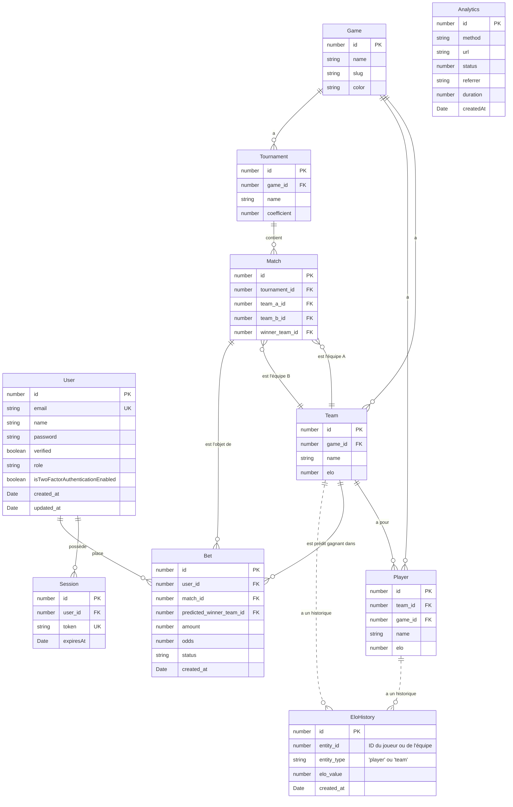
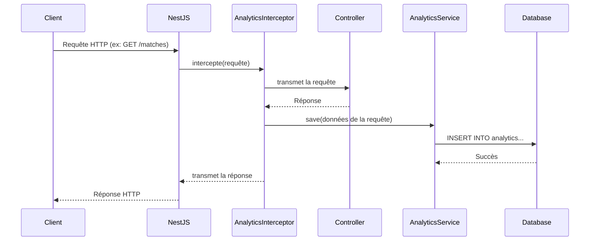

# Clutch: Architecture et Modèle de Données

## 1. Introduction

Clutch est une application innovante de paris sur l'esport. L'objectif principal est de fournir une plateforme permettant aux utilisateurs de placer des paris sur des matchs d'esports professionnels.

Initialement, l'application se concentrera sur les **paris gratuits** pour constituer une base d'utilisateurs et affiner les mécanismes de base. Le premier jeu à être intégré sera **Valorant**, avec des données provenant de [vlr.gg](https://www.vlr.gg/).

## 2. Architecture

L'application est conçue avec une architecture multi-jeux évolutive. Cela garantit que de nouveaux jeux pourront être facilement intégrés à l'avenir avec des modifications minimales de l'infrastructure de base.

### 2.1. Principes Fondamentaux

- **Modularité** : Les fonctionnalités de base (paris, gestion des utilisateurs, calcul ELO) sont découplées de la logique spécifique au jeu.
- **Évolutivité** (Scalability) : L'architecture est conçue pour gérer un nombre croissant d'utilisateurs, de jeux et de matchs.
- **Extensibilité** : L'ajout d'un nouveau jeu devrait être aussi simple que la création d'un nouveau module dans le répertoire `games`.

### 2.2. Structure des Dossiers

La structure de dossiers de haut niveau proposée est la suivante :

```
/src
├── /core                   # Logique métier principale
│   ├── /auth               # Authentification et gestion des sessions
│   ├── /bet                # Système de paris
│   ├── /elo                # Moteur de calcul ELO et des cotes
│   ├── /games              # Modules spécifiques aux jeux
│   │   └── /valorant       # Exemple pour Valorant
│   │       ├── /matches
│   │       ├── /players
│   │       └── /teams
│   └── /users              # Gestion des utilisateurs
└── /infrastructure         # Préoccupations transversales (base de données, mailer, etc.)
```

## 3. Schéma de la Base de Données

Le schéma ci-dessous a été conçu pour être à la fois robuste et évolutif, en adoptant une approche générique pour la gestion de plusieurs jeux.

### 3.1. Concepts Clés du Schéma

- **Approche Générique (Multi-Jeux)** : Plutôt que d'utiliser des préfixes spécifiques à chaque jeu (comme `val_`), nous utilisons des tables génériques (`Team`, `Player`, `Match`). La table `Game` sert de pivot, et une clé étrangère `game_id` est utilisée dans les autres tables pour maintenir le contexte du jeu.
- **Résolution des Paris** : Pour déterminer le résultat d'un pari, la table `Match` inclut une colonne `winner_team_id` et la table `Bet` une colonne `predicted_winner_team_id`.
- **Historique ELO** : Une table `EloHistory` est introduite pour suivre les variations du score ELO des joueurs et des équipes dans le temps. Cela permet d'analyser les performances et d'afficher des graphiques de progression.

### 3.2. Diagramme Entité-Relation (ERD)



## 4. Infrastructure

La couche `Infrastructure` regroupe les modules techniques qui fournissent des services essentiels à l'ensemble de l'application. Elle est conçue pour être découplée de la logique métier (le `Core`), ce qui permet de la faire évoluer ou de la remplacer sans impacter le reste du code.

### 4.1. Database

Ce module est responsable de la connexion à la base de données.

- **Technologie** : Il utilise **TypeORM** pour communiquer avec une base de données **PostgreSQL**.
- **Rôle** : Il fournit la configuration nécessaire pour que les entités définies dans le `Core` puissent être mappées aux tables de la base de données et interrogées.

### 4.2. Mailer

Le module `Mailer` gère l'envoi d'e-mails transactionnels.

- **Utilisation** : Essentiel pour des fonctionnalités comme la confirmation d'inscription, la réinitialisation de mot de passe ou l'envoi de codes pour l'authentification à deux facteurs (2FA).

### 4.3. Analytics

Ce module fournit des informations sur l'utilisation et les performances de l'application en enregistrant les requêtes HTTP.

- **Fonctionnement** : Il utilise un **intercepteur NestJS** (`AnalyticsInterceptor`) qui s'exécute automatiquement pour chaque requête entrante.
- **Collecte de Données** : L'intercepteur mesure le temps de traitement de la requête et enregistre des informations clés (méthode, URL, statut, etc.) dans la table `Analytics` de la base de données PostgreSQL.

Voici un diagramme de séquence qui illustre le fonctionnement de l'intercepteur analytique :




