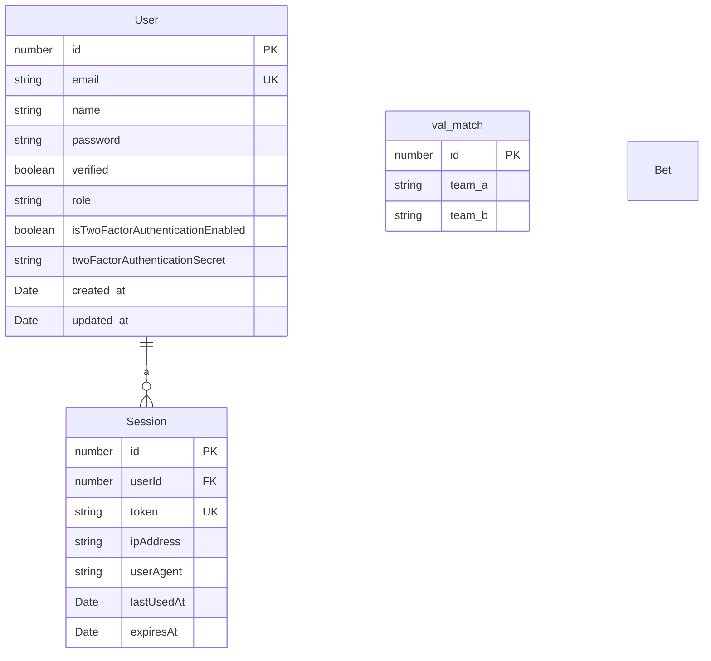

# Clutch: Architecture et Modèle de Données

## 1. Introduction

Clutch est une application innovante de paris sur l'esport. L'objectif principal est de fournir une plateforme permettant aux utilisateurs de placer des paris sur des matchs d'esports professionnels.

Initialement, l'application se concentrera sur les **paris gratuits** pour constituer une base d'utilisateurs et affiner les mécanismes de base. Le premier jeu à être intégré sera **Valorant**, avec des données provenant de [vlr.gg](https://www.vlr.gg/).

## 2. Architecture

L'application est conçue avec une architecture multi-jeux évolutive. Cela garantit que de nouveaux jeux pourront être facilement intégrés à l'avenir avec des modifications minimales de l'infrastructure de base.

### 2.1. Principes Fondamentaux

- **Modularité** : Les fonctionnalités de base (paris, gestion des utilisateurs, calcul ELO) sont découplées de la logique spécifique au jeu.
- **Évolutivité** (Scalability) : L'architecture est conçue pour gérer un nombre croissant d'utilisateurs, de jeux et de matchs.
- **Extensibilité** : L'ajout d'un nouveau jeu devrait être aussi simple que la création d'un nouveau module dans le répertoire `games`.

### 2.2. Structure des Dossiers

La structure de dossiers de haut niveau proposée est la suivante :

```
/src
├── /core                   # Logique métier principale
│   ├── /auth               # Authentification et gestion des sessions
│   ├── /bet                # Système de paris
│   ├── /elo                # Moteur de calcul ELO et des cotes
│   ├── /games              # Modules spécifiques aux jeux
│   │   └── /valorant       # Exemple pour Valorant
│   │       ├── /matches
│   │       ├── /players
│   │       └── /teams
│   └── /users              # Gestion des utilisateurs
└── /infrastructure         # Préoccupations transversales (base de données, mailer, etc.)
```

### 2.3. Flux de Données : Traitement des Matchs

Le système récupère en continu les données des matchs à venir. Le flux typique pour le traitement d'un nouveau match est le suivant :

1.  **Récupération des Données du Match** : une tâche planifiée récupère les données des matchs à venir à partir d'une API externe (par exemple, vlr.gg pour Valorant).
2.  **Vérification des Entités Existantes** : Le système vérifie si les équipes et les joueurs impliqués dans le match existent déjà dans la base de données.
3.  **Création de Nouvelles Entités** : Si une équipe ou un joueur est nouveau, il est ajouté à la base de données.
4.  **Calcul des Cotes** : Le service ELO calcule le classement ELO initial pour les nouvelles entités et met à jour les cotes pour le match.
5.  **Rendre le Match Disponible aux Paris** : Le match est ensuite rendu disponible sur la plateforme pour que les utilisateurs puissent y placer des paris.

## 3. Schéma de la Base de Données

Le diagramme suivant illustre les relations entre les entités principales de la base de données.




