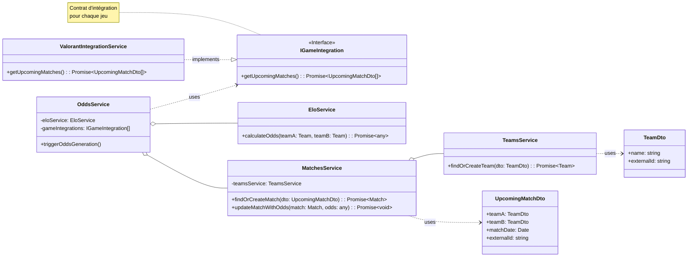
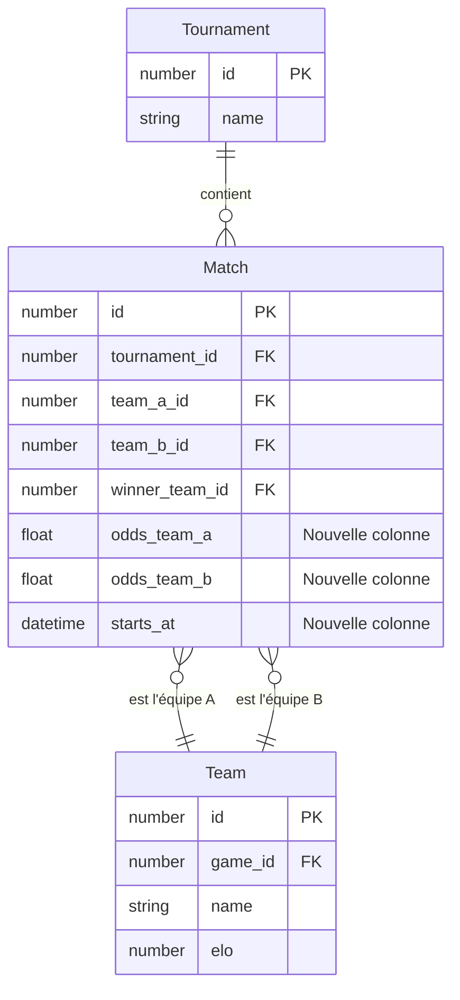

# Architecture et Conception : Module de Génération des Cotes

## 1. Introduction et Objectifs

Ce document décrit l'architecture et la conception technique pour l'implémentation du module de génération de cotes au sein de l'application Clutch. L'objectif est de créer un système robuste, modulaire et extensible capable de calculer et de stocker les cotes pour des matchs d'esports, en commençant par le jeu Valorant.

Les principes directeurs de cette conception sont :
- **Modularité** : Isoler la logique métier principale de la logique spécifique à chaque jeu.
- **Extensibilité** : Permettre l'ajout facile de nouveaux jeux (ex: League of Legends, CS:GO) sans impacter le cœur du système.
- **Clarté** : Utiliser des noms clairs, des contrats de données (DTOs) et une séparation nette des responsabilités pour garantir la maintenabilité du code.

---

## 2. Roadmap d'Implémentation

L'implémentation se déroulera en suivant les étapes ci-dessous :

1.  **Étape 1 : Définition des Contrats**
    - Création de l'interface `IGameIntegration` qui définit les méthodes obligatoires pour tout service d'intégration de jeu (ex: `getUpcomingMatches`).
    - Création des DTOs (Data Transfer Objects) `UpcomingMatchDto` et `TeamDto` pour standardiser les données échangées entre les couches.

2.  **Étape 2 : Service d'Intégration pour Valorant**
    - Création de `ValorantIntegrationService` qui implémente `IGameIntegration`.
    - Ce service contiendra la logique spécifique pour appeler l'API externe (VLR.gg) et transformer les données brutes en `UpcomingMatchDto`.

3.  **Étape 3 : Mise à jour du Modèle de Données**
    - Ajout des colonnes `odds_team_a` et `odds_team_b` à la table `Match` pour stocker les cotes calculées.

4.  **Étape 4 : Adaptation des Services de Domaine**
    - Mise à jour de `TeamsService` et `MatchesService` pour qu'ils puissent créer ou retrouver des entités à partir des DTOs fournis par le service d'intégration.

5.  **Étape 5 : Orchestration par `OddsService`**
    - Refactorisation complète de `OddsService` pour qu'il agisse en tant qu'orchestrateur.
    - Il ne contiendra aucune logique spécifique à un jeu mais utilisera les services d'intégration pour récupérer les données.

6.  **Étape 6 : Intégration du Calcul ELO et Stockage**
    - `OddsService` fera appel à `EloService` pour calculer les cotes à partir des entités `Team`.
    - Les cotes résultantes seront persistées en base de données via `MatchesService`.

7.  **Étape 7 : Automatisation via Cron Job**
    - Mise en place d'une tâche planifiée (Cron Job) qui déclenchera périodiquement la méthode principale de `OddsService` pour mettre à jour les cotes.

---

## 3. Architecture et Diagrammes

### 3.1. Diagramme de Séquence

Ce diagramme illustre le flux de bout en bout, depuis le déclenchement par le Cron Job jusqu'à la mise à jour des cotes en base de données.

```mermaid
sequenceDiagram
    participant CronJob
    participant OddsService
    participant GameIntegration as "IGameIntegration (Valorant)"
    participant MatchesService
    participant TeamsService
    participant EloService
    participant Database

    CronJob->>+OddsService: triggerOddsGeneration()

    Note over OddsService: Pour chaque jeu supporté
    OddsService->>+GameIntegration: getUpcomingMatches()
    GameIntegration-->>-OddsService: upcomingMatches: UpcomingMatchDto[]

    loop Pour chaque nouveau match
        OddsService->>+MatchesService: findOrCreateMatch(matchDto)
        
        MatchesService->>+TeamsService: findOrCreateTeam(matchDto.teamA)
        TeamsService->>+Database: SELECT/INSERT Team A
        Database-->>-TeamsService: teamA: Team
        TeamsService-->>-MatchesService: teamA: Team

        MatchesService->>+TeamsService: findOrCreateTeam(matchDto.teamB)
        TeamsService->>+Database: SELECT/INSERT Team B
        Database-->>-TeamsService: teamB: Team
        TeamsService-->>-MatchesService: teamB: Team

        MatchesService->>+Database: SELECT/INSERT Match
        Database-->>-MatchesService: match: Match
        MatchesService-->>-OddsService: match: Match

        OddsService->>+EloService: calculateOdds(match.teamA, match.teamB)
        EloService-->>-OddsService: odds: { teamA: 1.5, teamB: 2.5 }

        OddsService->>+MatchesService: updateMatchWithOdds(match, odds)
        MatchesService->>Database: UPDATE Match SET odds_team_a=1.5, ...
        Database-->>-MatchesService: OK
        MatchesService-->>-OddsService: 
    end
```

### 3.2. Diagramme de Classes

Ce diagramme présente les classes principales du module, leurs relations et leurs responsabilités.



### 3.3. Évolution du Modèle de Données

Pour stocker les cotes directement sur un match, nous devons amender la table `Match`. Le diagramme ci-dessous met en évidence les ajouts.



---

## 4. Spécifications Fonctionnelles

| ID | Description |
| --- | --- |
| **SF-ODDS-01** | Le système doit pouvoir récupérer périodiquement la liste des matchs à venir via une source de données externe (API). |
| **SF-ODDS-02** | Pour chaque match récupéré, le système doit identifier les deux équipes et les créer en base de données si elles n'existent pas. |
| **SF-ODDS-03** | Pour chaque match récupéré, le système doit créer une entrée en base de données si elle n'existe pas, en évitant les doublons. |
| **SF-ODDS-04** | Le système doit calculer les cotes pour chaque match en se basant sur une formule, initialement le classement ELO des deux équipes impliquées. |
| **SF-ODDS-05** | Les cotes calculées doivent être sauvegardées en base de données et associées au match correspondant. |
| **SF-ODDS-06** | L'architecture doit permettre d'ajouter un nouveau jeu (ex: une nouvelle implémentation de `IGameIntegration`) sans modifier le `OddsService` ou la logique métier centrale. |
| **SF-ODDS-07** | Le processus complet de mise à jour des cotes doit être automatisé et s'exécuter à intervalle régulier (ex: toutes les heures). | 
